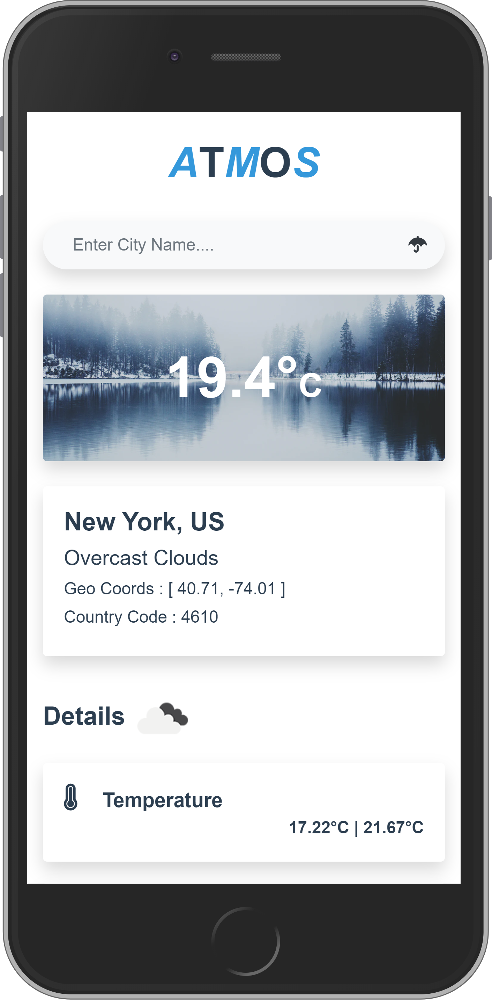
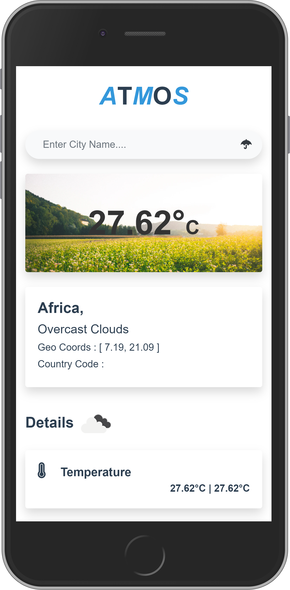
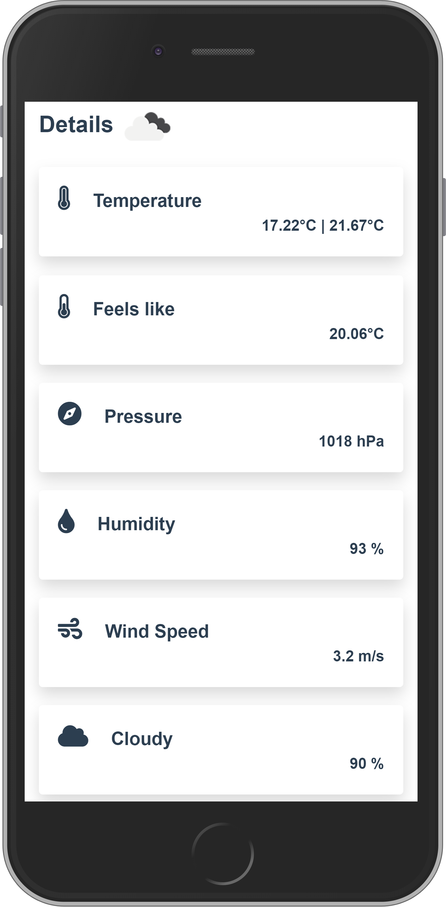

# Atmos

Atmos is a weather app made with vue js. You can search weather information by city name. It will information such as current Weather status, Temperature, Min - Max Temperature, Pressure , Wind Speed, Humidity, Cloud percentage, Geo Coords, Country Code And also depending on the Temperature the wallpaper will change for show a summer or a winter image. [Openweather](https://openweathermap.org/) API was used for the weather data. Soon I will be adding daily weather graph to this webapp

[](Winter)
[](Summer)
[](Info)


## Dependencies
    "axios": "^0.19.2",
    "core-js": "^3.6.5",
    "vue": "^2.6.11"


## Project setup
```
npm install
```

### Compiles and hot-reloads for development
```
npm run serve
```

### Compiles and minifies for production
```
npm run build
```

### Lints and fixes files
```
npm run lint
```

### Customize configuration
See [Configuration Reference](https://cli.vuejs.org/config/).
